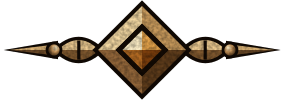

# Design System: PoE2 Tools

## 北极星

**「藏身处里的锻铜工作台」**：外层容器有游戏界面的金属感和仪式感，数据区保持工具的清晰。名字沿用此前的「藏身处工作台」，内涵从“克制的炭灰石板”改为这一句（2026-09-28 设计规格经用户批准，2026-09-29 批准三视口基准 mockup）。

- 只保留深色，没有主题切换。
- 素材只用自绘 SVG/CSS 与 SIL OFL 1.1 字体；不使用、不热链、不描摹 Grinding Gear Games（GGG）、腾讯、Craft of Exile（CoE）的任何素材或纹样。
- 取值源：令牌与组件样式在 `packages/ui-theme`（`src/tokens.css` 是唯一的颜色、字体与动效令牌块，尺寸阶梯另见下一条，`src/components/*.css` 是 `pt-*` 组件）；页面专属样式在 `apps/site/src/shared/styles/`。上方 frontmatter 是 tokens.css 的快照，两者不一致时以 tokens.css 为准。
- 尺寸阶梯在 `packages/ui-theme/src/scale.css`（`--fs-*` 九档字号、`--sp-*` 八档间距），只由网站入口引入；页面层样式（`apps/site/src/shared/styles/*.css`）的字号与间距一律取令牌，由 `apps/site/src/testing/scale-tokens.test.ts` 把关；边框、圆角、列宽、图标宽这类几何尺寸除外，门禁里逐条登记理由。三个页面入口都在 `base.css` 之前引入 `scale.css`。扩展在第三期接入时并入 `tokens.css`。
- 历史工坊 `/craft/` 冻结在改版前的样式（`apps/site/src/features/craft/legacy-*.css`），不接入本设计语言。
- 扩展的设置弹窗、CoE 注入界面与图标属于二期，在扩展分支另行接入：弹窗照 L3，注入界面封顶 L1。

## 强度分层与白名单

| 层级 | 用在哪里 | 允许 | 禁止 |
|---|---|---|---|
| L3 沉浸 | 全站页头；首页、扩展介绍页；构筑工作台的外层容器（空态框、主区框；侧栏“文件”是 L0 面板） | pt-frame 金属框与角饰、窗口标题栏、金属页签、pt-backdrop；白名单内的金属主按钮；衬线（见“字体”）；只用于 hero 标题的金色渐变字 | 框中框；标题栏两端端饰；同屏角饰超过 8 个 |
| 游戏对象 | 名称牌、装备卡、译文提示框 | 两行居中；中文名衬线、英文名 Cinzel；三段深色渐变底；顶边菱结扣；0.05 颗粒 | 角饰、辉光、大面积亮色底；名称牌下面的对照行仍是 L0 |
| L1 点缀 | CoE 注入界面（二期） | 扁平深底、1px 金线、16px 青色宝石、“PoE2 中文助手 · 非官方”署名、完整声明 | 金属按钮、角饰、衬线、渐变填充、页头式金属底边 |
| L0 数据 | 对照行、表单、说明正文、命令块、弹层、待核对清单、状态条、404 | 平涂底、系统无衬线、左对齐、`tabular-nums` | 纹理、辉光、小型大写、文字居中、渐变字、衬线 |

“每屏”指同一路由状态下同时渲染的界面，弹层、Toast、展开的折叠区都算进它们覆盖的状态。

| 路由状态 | 金属主按钮（最多 1 个） | pt-frame（角饰） |
|---|---|---|
| 首页 | 无 | 1（4） |
| 扩展介绍页 | “下载扩展（v<版本>，zip，<大小>）” | 1（4） |
| 构筑·空态 | 空态框内“选择 .build 文件” | 1（4） |
| 构筑·词典失败 | 无 | 1（4）（有无文件均如此） |
| 构筑·已导入 | “下载中文 .build” | 1（4） |
| 构筑·解析失败或等词典 | 无 | 1（4） |
| 404 | 无 | 0 |

阶段看板与逐项核对各是一个路由状态，各自只有一扇主区框；侧栏是 L0 面板，不再有第二扇框，所以 ≤1099px 也不再减框。

**注意力落点**：首页是对照带（唯一一扇金属框包住的中英对照示例带，中缝铜线与菱结属于框内母题，不另算落点），扩展介绍页是下载框（“先确认环境”与“再下载”两栏所在的 hero 框），构筑看板是主区框与阶段带（列头底线），逐项核对是主区框。首页的两个入口是同款 `pt-btn`，左右镜像，没有金属主按钮。看板里的标题栏只在看板上降为平涂（`.app__build-frame--board > .pt-titlebar`：`bar` 底、`line-2` 底线、仍是衬线金字），让阶段带成为落点：阶段带是 2px `metal-line` 底线加 1px `metal-edge` 顶线和暖色渐变底，阶段名用衬线。逐项核对保留金属标题栏。装备与技能在看板里是 L0 行，名称牌只在展开详情与逐项核对里出现。侧栏在看板显示多个阶段时用紧凑行（无边框与金线，单行省略名称，隐藏原名）。

其余按钮一律用 pt-btn。层级例外只有四项：名称牌与译文提示框居中并使用衬线和 Cinzel；扩展弹窗页脚居中；扩展弹窗的设置开关用金属轨道；CoE 注入界面保留三处宿主全局样式。其他偏离都要先改设计规格。

## 色彩

- 表面：页面底 `page`（pt-backdrop、404）；平涂底 `bg`、状态条 `bg-2`；L0 面板 `surface`；弹层与安静按钮 `raised`；选中项 `raised-2`；框内底 `frame-bg`；装备卡与示例区 `well`；ErrorCard 与天赋列表 `card`；工具栏与折叠条 `bar`。
- 线条：`line`、`line-2` 只作非交互分隔；交互控件的边界一律用 `control-edge`（对全部表面 ≥3.67:1）；`metal-*` 画金属线、页签边和当前导航底线。
- 文字与金属：`ink`、`ink-2`、`ink-3`（只用于 12px 及以上的辅助文字，11px 只用于键帽，不用在名称牌上）；旧铜 `bronze-lo`、`bronze`、`bronze-hi`，金 `gold`，标题栏金字 `title-gold`。
- 游戏语义色独立一组，不从品牌色推导：词缀蓝 `mod`、`mod-hi`、`mod-num-zh`，属性灰 `prop`，数值白 `val`，传奇橙 `unique`、`unique-name`、`unique-name-2`、`unique-edge`，技能青 `gem`、`gem-en`。
- 状态：命中 `ok`、待核对 `miss`（未命中行底 `miss-bg`）、危险 `danger`、焦点 `focus`（`--focus-ring: 2px solid var(--focus)`，外偏移 3px）。状态色不和稀有度色混用，每个状态同时带图标或文字。
- 14 个 `mk-*` 游戏标记色渲染 `.build` 的标记语法，只用于对照行和译文提示框正文，不用于名称牌名称。
- 宝石刻面 `gem-1`…`gem-4` 表示归属：站点琥珀是默认值；扩展青 `.pt-attr-ext`（`#c9f5f0 / #2fbdb3 / #0b4a46 / #1a8780`）只表示扩展；传奇橙（`#ffd8b5 / #f07a2c / #6e2405 / #b44f19`）用于传奇名称牌的扣，由 `.pt-nameplate--unique` 设置，与预设类 `.pt-attr-unique` 同值。网站上的宝石一律不用青色。
- 对比度由 `packages/ui-theme/src/tokens.test.ts` 把关：文字令牌对全部表面 ≥4.5:1，控件边界、焦点、亮铜边 ≥3:1，名称牌各变体、金属主按钮和页签计数色另有专项门禁。

## 字体

| 位置 | 字体 | 字号 | 字距 |
|---|---|---|---|
| 页头导航 | 衬线 700 | 15px | .06em |
| 首页 hero 标题 | 衬线 700 | 36px（≤620px 28px，页面层取 `--fs-display`、`--fs-display-s`） | .02em |
| 扩展介绍页 hero 标题 | 衬线 700 | 44px（≤620px 34px） | .02em |
| 构筑空态 hero 标题 | 衬线 700 | 36px（≤620px 28px） | .02em |
| pt-frame 标题栏 | 衬线 700 | 19px | .1em |
| 金属主按钮 | 衬线 700 | 15.5px（扩展介绍页下载按钮 ≤620px 时分两行，第二行版本与大小 12px） | .04em（该第二行 .02em） |
| 金属页签 | 衬线 700 | 15px（计数用无衬线 500 13px） | .06em |
| 扩展介绍页分步标题（先确认环境、再下载） | 衬线 700 | 21px | .06em |
| 首页场景标题 | 衬线 700 | 28px（≤1099px 21px，页面层取 `--fs-title`） | .06em |
| 名称牌名称 | 衬线 700 | 20px（译文提示框 21px） | .03em（提示框 .04em） |
| 阶段名（阶段看板） | 衬线 700 | 21px（≤620px 17px，取 `--fs-title`、`--fs-lead`） | .04em |
| 物品、宝石英文名 | Cinzel 400 | 13px | .04em |

- 中文衬线是 Noto Serif SC、Noto Serif TC 的 wght 700 实例，Cinzel 是 wght 400 实例，按分片自托管在 `packages/ui-theme/fonts/`，`font-display: swap`。页面用站点私有别名 “PoE2 Serif SC”“PoE2 Serif TC”“PoE2 Cinzel”，缺字时逐级回退到本机字体。
- 首页只下载 `serif-sc-0` 一个字体文件，预算 122,880 字节，构建期有守卫。网站的衬线固定文案都列在 `packages/ui-theme/scripts/shard0-text.txt`；新增衬线文案先补进这个文件，再运行 `pnpm ui-theme:fonts`。
- 扩展弹窗用自己的字体子集 `serif-sc-popup`：弹窗衬线文案列在 `packages/ui-theme/scripts/popup-text.txt`，字体声明在 `fonts/popup.css`。网站文案与 `shard0-text.txt` 的变化不再改变扩展 zip；改弹窗衬线文案会改变扩展 zip，要连同扩展版本一起发布。
- 繁体衬线只用于名称牌和提示框里 `lang="zh-TW"` 的词典名称；站点固定文案一律用简体栈。
- 衬线文字里的 ASCII 文件扩展名片段（如 `.build`）用无衬线（`.pt-ext`）。L0 与 L1 不用衬线；页面层 CSS 不写衬线字体栈，需要衬线时做成 ui-theme 组件类并列入 `SERIF_SELECTORS`。只改字号的修饰类（如 `.pt-subhead--lg`）继承所属组件的衬线，不另列。
- 正文与数据用系统无衬线（`--font-zh-cn`、`--font-zh-tw`），代码用 `--font-code`；门户页（首页、扩展介绍页）正文 15px/1.6，构筑页正文 14px/1.65，对照行 15px/1.6，数字用 `tabular-nums`。
- 页面层字号取 `scale.css` 的 `--fs-*` 阶梯：12、13、14、15、17、21、28、36、54px，与上表各行对应（如阶段名 `--fs-title`、对照行 `--fs-data`）。组件文件不引用 `--fs-*`（扩展不引入 `scale.css`），组件里的字号都是字面值；首页需要别的字号时由页面层用令牌覆盖。首页 hero 标题：组件 `.pt-hero-title` 默认 54px，`home.css` 改为 `--fs-display`（36px），≤620px 为 `--fs-display-s`（28px）。首页场景标题：宽屏的 28px 来自组件 `.pt-subhead--lg` 的字面值（与 `--fs-display-s` 同值），≤1099px 由 `home.css` 改为 `--fs-title`（21px）。
- 字标是无衬线 600 的“PoE2 Tools”，“PoE2”用金色；禁止英文小型大写副标，禁止用 Cinzel 做字标。

## 母题「符文菱结」

**原创来源与演进**（为应对“衍生作品”指控保留的设计档案）

1. 起点是站点原有的 ◇ 字标图标：改版前 `apps/site/src/shared/components/Icon.tsx` 的 `brand`，两层同心菱形（外菱 `M12 2.5 20 12l-8 9.5L4 12z`，内菱 `M12 7.5 16.2 12 12 16.5 7.8 12z`）。一期改用母题字标后，这个图标已删除。
2. 2026-09-28 设计调研：题材取哥特与铜金工艺的一般造型语言（斜面、刻面宝石、尖拱、铆钉）；为避免被认定为 GGG 纹样的衍生作品（GGG 使用条款第 7 条第 1 项），自绘时不临摹或描摹任何游戏或 CoE 的具体纹样，也不照着截图描边。
3. 同日的 A/B/C 三档强度 mockup 把 ◇ 发展为“斜面菱环 + 四刻面宝石”的核心，两侧加尖拱叶瓣和收尖臂；斜面和宝石都用四块平涂刻面，不靠渐变。用户选定 C「沉浸」修订版。两位 mockup 评审核对后确认没有描摹：它和 CoE 的有机卷草角饰在构造逻辑、轮廓和放置方式上都不同。
4. 2026-09-29 用户批准三视口基准 mockup。母题只保留实际用到的符号：`corner`（框角 40px，≤620px 为 28px）、`knot`（分隔线 31×12、名称牌扣 36×14）、`logo`（页头 46×24、favicon、404）、`gem`（按钮两端 11px）；全形 `knot-full`（叶瓣、刻痕、铆钉、颗粒）只用于本档案图。
5. 一期实现把几何收进唯一源 `packages/ui-theme/src/motif.ts`，颗粒收进 `src/noise.ts`；`scripts/build-motif-css.mjs`（`pnpm ui-theme:motif`）生成 `src/generated/` 下的 CSS 自定义属性与 SVG，`motif.test.ts` 逐字节比对生成物与站点副本。

**用法**

- 每个母题分两层：底层（斜面、臂、叶瓣，固定刻面色）画在 `::before`；宝石层用 `mask-image` 加 conic 四刻面画在 `::after`，颜色由祖先元素上的 `--gem-1..4` 决定。
- 角饰画在 pt-frame 的两个伪元素上，外伸 12px（≤620px 为 9px），`z-index: 3` 压在标题栏之上；pt-frame 的子孙不设 3 及以上的 z-index，pt-frame 及其祖先不用 `overflow: hidden|clip` 或 `contain: paint`，框外留白不小于外伸量。
- 母题一律 `aria-hidden`，强制色彩下隐藏。

## 组件

组件类在 `packages/ui-theme/src/components/`；网站的 React 包装在 `apps/site/src/shared/components/`（Motif、PtDivider、PtTitlebar、PtFrame、PtPanel、PtForgeButton、PtTabs、PtNameplate、SiteHeader、SiteFooter）。

| 组件 | 层级 | 要点 |
|---|---|---|
| `pt-backdrop` | L3 | 页面根容器：`page` 底，叠顶光与暗角两层渐变和 0.05 高频细颗粒；数据区平涂 |
| `pt-header` | L3 | 高 74px，三层金属底线；导航用衬线，当前页有 2px 亮铜内嵌底线；≤850px、≤620px 换行 |
| `pt-frame` / `pt-titlebar` | L3 | 2px 金属渐变框加四角角饰；标题栏高 46px，居中衬线金字，只占一行，超长时省略并用 `title` 给出全文 |
| `pt-panel` | L3 内层 / 游戏对象 | `card`（ErrorCard、天赋列表）、`item`（装备卡、技能卡、提示框，边色随稀有度）、`inset`（示例区：构筑空态示例、首页对照带、扩展介绍页搜索候选示意） |
| `pt-forge-btn` | L3 | 每个路由状态最多一个；旧铜渐变、两端琥珀宝石，悬停整体提亮，按下下移 1px |
| `pt-btn` | L0 / L3 | 其余全部按钮：默认铜边金字，`--quiet` 中性边；另有 `--sm`、`--xs`、`--wide`、`--block` |
| `pt-tabs` | L3 | 构筑页签：金属片，选中页签下沿接通基线，未选中留 2px 缝；ARIA tabs 键盘模型 |
| `pt-nameplate` | 游戏对象 | 装备与技能名称牌：两行居中，base、unique、gem、collapsed 四种变体，顶边菱结扣 |
| `pt-divider` | 通用 | 两侧渐隐线加中心菱结，只用在指定位置 |
| `pt-chip` | 通用 | 不可点击的标签；标题栏里用金属配色，窄容器时移到卡体第一行 |
| `pt-hero-title` | L3 | hero 标题的三种字号与金色渐变字 |
| `pt-subhead` | L3 | 衬线小标题 21px：扩展介绍页的分步标题（先确认环境、再下载）；`--lg` 修饰类 28px，用于首页两个场景标题，只改字号；首页在 ≤1099px 由页面层改为 21px，所以组件自带的 ≤620px 21px 规则在首页不起作用 |
| `pt-stagehead` | L3 | 阶段看板的阶段名与首页对照带示例的阶段名：衬线 700，`lang="zh-TW"` 切 TC 栈；字号与颜色由页面层决定，已列入 `SERIF_SELECTORS`；由构筑页与首页入口引入 |
| `stageboard`（页面层） | L0 | 阶段并排对照表：列头一条 `metal-line` 底线（阶段带），格子是按钮，“新／换”用亮铜左边线加文字标记，“改”（同一件词缀有变化）只把词缀变化写成铜色、不加标记字，悬停或聚焦整行提亮 |
| 对照行、表单、弹层、状态条 | L0 | 平涂、无衬线、左对齐；未命中行有四重标记（底色、左色条、“!”方框、虚线下划线） |

浏览器基线：组件样式依赖 `:has()` 与容器查询（`@container`），以支持这两项的现行浏览器为准，不另写旧浏览器回退。不支持 `:has()` 的浏览器不在支持范围：分段控件的选中态与焦点环、文件当前项、拖放区焦点环、无标题栏 hero 框的内边距都依赖它；设计规格附录 B.7 记录的 600px 及以下名称牌组内“·”不显示是其中一例。

## 动效与无障碍

- 金属主按钮悬停时整体提亮一档，没有外发光；按下时 `translateY(1px)`。页签、分段控件、按钮的颜色过渡为 140ms。不做循环动画、视差和粒子。
- `prefers-reduced-motion: reduce` 时取消下压位移和全部过渡，悬停提亮保留，改为即时变色。
- 强制色彩：框、按钮、页签、分段控件保留边界（CanvasText、ButtonText、Highlight），母题与颗粒隐藏，渐变字退回纯色。
- 选中态不只靠颜色：页签靠下沿接通基线加亮边，分段控件选中项靠 600 字重加内边；“仅看待核对”按下态靠内边与底色（强制色彩下未聚焦为 Highlight 内框，键盘聚焦时为 2px Highlight 边框加焦点环）；文件项靠左色条加边色，导航当前页靠底线。
- 焦点环统一为 2px `focus`、外偏移 3px；可聚焦元素的祖先不裁掉焦点环。600px 及以下，可点目标不小于 44px。
- 每次视觉修改先查阻断问题（对比度、焦点、溢出），再查层级布局和细节；仓库级设计技能与固定版本见 `docs/design-skills.md`，技能不进入网站或扩展产物。

## 禁止事项

- 不使用、不热链、不描摹 GGG、腾讯、CoE 的任何素材、纹样或字体；不照着游戏或 CoE 截图描边；不使用 Fontin。
- 不做浅色主题与主题切换；不做营销式动效（视差、粒子、循环辉光）和整页 key art。
- 不新增含游戏名的 meta、og 或关键词，不做 og:image；今后的推广截图只用本站自己的界面和自绘母题。
- 不把 pt-frame 放进另一扇 pt-frame；不在白名单以外放金属主按钮；不在 L0 数据区用纹理、辉光、衬线或渐变字。
- 不手改生成物（`packages/ui-theme/src/generated/`、`packages/ui-theme/fonts/`、`apps/site/public/favicon.svg`）。
- 不把首页示意图称作真实扩展截图，不把源码预览写成公开发行；本地通过与线上部署分开报告。
